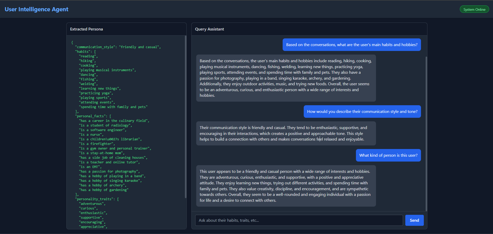

# KaStack Submission – User Intelligence Agent

## Live Demo

* GitHub Repository: https://github.com/kumarvarun3162/Kastak-Submission
* Live Application: https://kastak-submission-production.up.railway.app
* Loom Demo: https://www.loom.com/share/104adc274a31401289efdaf34d77a708

---

## Project Overview

This project analyzes conversation history to build a user persona and answer questions about the user using Retrieval-Augmented Generation (RAG).

The system processes conversations chronologically, detects topic boundaries, extracts personality insights, stores semantic summaries in a vector database, and uses those summaries to answer user queries.

---

## How Topic Changes Are Detected

Topic splitting is performed chronologically.

1. Each message is converted into an embedding using the `all-MiniLM-L6-v2` model.
2. A running topic cluster is maintained.
3. For every new message, cosine similarity is calculated between:

   * the message embedding
   * the mean embedding of the current topic
4. If similarity remains above the threshold (0.50), the message is added to the current topic.
5. If similarity falls below the threshold, a topic boundary is created and a new topic begins.

This ensures that conversations are segmented based on semantic meaning rather than fixed chunk sizes.

---

## How Retrieval Works

After topic summaries are generated:

1. Each summary is converted into an embedding.
2. Embeddings are stored in ChromaDB.
3. When a user submits a query:

   * The query is embedded.
   * ChromaDB performs semantic similarity search.
   * The top matching summaries are retrieved.
4. Retrieved summaries are used as context for the final LLM prompt.

This allows the system to retrieve information based on meaning instead of keyword matching.

---

## How Persona Is Built

After all topic summaries are generated:

1. Topic summaries are combined into a condensed representation of the conversation history.
2. The LLM analyzes the summaries.
3. The model extracts:

   * Habits
   * Personal facts
   * Personality traits
   * Communication style
4. Results are stored in structured JSON format.

The persona acts as a high-level memory layer that complements retrieval from conversation summaries.

---

## System Flow

Conversation CSV
→ Topic Detection
→ Topic Summarization
→ Persona Extraction
→ ChromaDB Storage
→ Semantic Retrieval
→ RAG Response Generation

---

## Running Locally

Install dependencies:

```bash
pip install -r requirements.txt
```

Create a `.env` file:

```env
GROQ_API_KEY=your_api_key
```

Run:

```bash
uvicorn main:app --reload
```

Open:

```text
http://localhost:8000
```

---

## Screenshots



* Dashboard
* Persona Extraction Panel
* Query Results
* Retrieval Examples

---

## Video Demonstration

Loom Video:

https://www.loom.com/share/104adc274a31401289efdaf34d77a708
